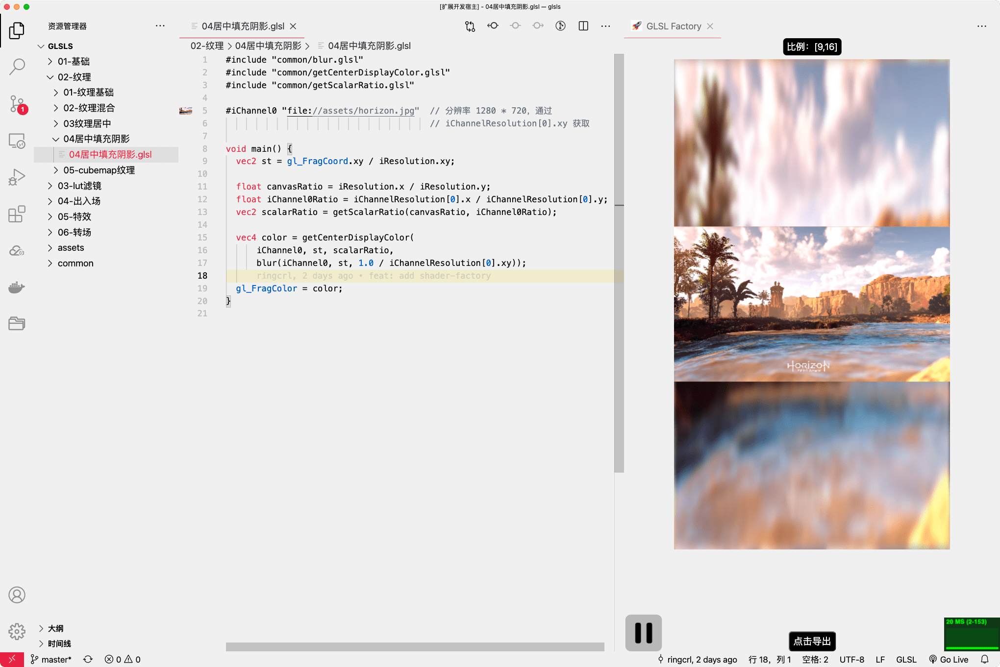

#  Shader factory - VSC Extension

通过提供 `Show Shader Preview` 命令

- [x] 可以在 VSCode 中查看 GLSL 着色器的实时 WebGL 预览
- [x] 支持到行的编辑器内语法错误提示
- [x] 支持 16:9 与 9:16 等横竖屏效果预览
- [ ] 提供业务 shader 脚本导出能力
- [ ] 提供类似 [gl-transition](https://gl-transitions.com/) 的贝塞尔配置能力

## 安装

VSCode Extension 搜索 `Shader factory`

## 使用

打开片元着色器，可以参考本项目 `glsl` 目录，随便打开一个 glsl 文件，`shift + cmd + p` 搜索 `shader factory`

- `Shader Factory: Show Shader Preview`，直接实时预览 
- `Shader Factory: Create HTML`，导出 HTML


<!-- https://cdn-1257430323.cos.ap-guangzhou.myqcloud.com/assets/imgs/20210220195324_bb5040dff1db282716e0f5ea1e3f271d.png -->

## 开发

`npm i`

```sh
# 开启编译监听
npm run dev

# 打开 VSC Debug：Run Extension

# 打开 glsls 文件夹，选择对应的 glsl 进入开发
```

## 发布

```sh
npm run deploy
```

## 工具

- [x] bezier-generator 多级贝塞尔曲线生成器，用于生成 shader 动效计算值
- [ ] 三角函数和指数函数调试工具

## 特性

### 片段着色器入口

- `void main()`
- 如果 `void main()` 不可用，则为 `void mainImage(out vec4, in vec2)`，第一个参数是输出颜色，第二个参数是片段屏幕位置

### Uniforms

```glsl
// 目前可用的 `uniforms`，相当于

uniform sampler2D iChannelN; // 纹理
uniform vec2 iResolution; // 画布尺寸（宽、高）
uniform float iTime; // 着色器回放时间（加载后的秒数）
uniform float iTimeDelta; // 渲染时间（秒）
uniform int iFrame; // 着色器播放帧
uniform vec4 iMouse; // 鼠标像素坐标
uniform vec2 iMouseButton; // 鼠标按钮
uniform vec4 iDate; // (年，月，日，时间秒数)
uniform float iSampleRate; // 采样率
uniform vec3 iChannelResolution; // 通道分辨率(以像素为单位)
```

### 纹理输入

可以通过在着色器的顶部插入以下形式的代码来定义纹理通道 `iChannelN`，通过 `iChannelResolution[N]` 来获取纹理的宽高

```glsl
#iChannel0 "file://duck.png"
#iChannel1 "https://66.media.tumblr.com/tumblr_mcmeonhR1e1ridypxo1_500.jpg"
#iChannel2 "file://other/shader.glsl"
#iChannel2 "self"
```

这演示了使用本地和远程图像作为纹理（纹理大小要是 `2 ^ n`），将另一个着色器结果用作纹理，并通过指定 `self` 使用此着色器的最后一帧或使用音频输入。请注意，要将相对路径用于本地输入，必须在 VSC 中打开一个文件夹

要影响纹理的采样行为，请使用以下语法（由于WebGL标准，许多选项仅适用于宽度和高度为2的幂的纹理）：

```glsl
#iChannel0::MinFilter "NearestMipMapNearest"
#iChannel0::MagFilter "Nearest"
#iChannel0::WrapMode "Repeat"
```


### Shader 输入

您还可以通过类似C的标准语法将其他文件包含到着色器中：

```glsl
#include "some/shared/code.glsl"
#include "other/local/shader_code.glsl"
#include "d:/some/global/code.glsl"
```

这些着色器可能没有定义 `void main()` 函数，因此只能当做工具程序函数，常量定义等

### 自定义 Uniforms

要自定义 uniforms，直接在着色器中定义那些 uniform，并为其指定初始值和可选范围

```glsl
#iUniform float my_scalar = 1.0 in { 0.0, 5.0 } // 显示一个滑块以编辑值
#iUniform float my_discreet_scalar = 1.0 in { 0.0, 5.0 } step 0.2 // 显示滑块以0.2递增
#iUniform float other_scalar = 5.0 // 这将公开一个文本字段以提供任意值
#iUniform color3 my_color = color3(1.0) // 这可以作为颜色选择器进行编辑
#iUniform vec2 position_in_2d = vec2(1.0) // 这将显示两个文本字段
#iUniform vec4 other_color = vec4(1.0) in { 0.0, 1.0 } // 这将显示四个滑块
```

### 与 Shadertoy.com 兼容

以下是从 shadertoy.com 移植的着色器的示例：

- 用 `gl_FragCoord` 取代 `fragCoord`
- 用 `gl_FragColor` 取代 `fragColor`

```glsl
void main() {
  float time = iGlobalTime * 1.0;
  vec2 uv = (gl_FragCoord.xy / iResolution.xx - 0.5) * 8.0;
  vec2 uv0 = uv;
  float i0 = 1.0;
  float i1 = 1.0;
  float i2 = 1.0;
  float i4 = 0.0;
  for (int s = 0; s < 7; s++) {
    vec2 r;
    r = vec2(cos(uv.y * i0 - i4 + time / i1), sin(uv.x * i0 - i4 + time / i1)) / i2;
    r += vec2(-r.y, r.x) * 0.3;
    uv.xy += r;

    i0 *= 1.93;
    i1 *= 1.15;
    i2 *= 1.7;
    i4 += 0.05 + 0.1 * time * i1;
  }
  float r = sin(uv.x - time) * 0.5 + 0.5;
  float b = sin(uv.y + time) * 0.5 + 0.5;
  float g = sin((uv.x + uv.y + sin(time * 0.5)) * 0.5) * 0.5 + 0.5;
  gl_FragColor = vec4(r, g, b, 1.0);
}
```

`void main()` 委派给 `void mainImage(out vec4, in vec2)` 执行，`void main()` 通过正则 `/void\s+main\s*\(\s*\)\s*\{/g` 进行匹配，所以可以写成 `void main(void)` 这样。使用 `#StrictCompatibility` 可以设置严格模式，只允许使用 `mainImage` 而不允许使用 `void main()`，来获取更好的兼容性。

### 集成 glslify

可以通过设置启用 glslify，启用后可以像 node.js 一样模块化 glsl，但是会导致行号不对的问题

```glsl
#pragma glslify: snoise = require('glsl-noise/simplex/2d')

float noise(in vec2 pt) {
    return snoise(pt) * 0.5 + 0.5;
}

void main () {
    float r = noise(gl_FragCoord.xy * 0.01);
    float g = noise(gl_FragCoord.xy * 0.01 + 100.0);
    float b = noise(gl_FragCoord.xy * 0.01 + 300.0);
    gl_FragColor = vec4(r, g, b, 1);
}
```

### GLSL 预览

- 提供暂停按钮停止 iTime 更新
- 提供截图能力，截取当前屏幕的分辨率的图片
- 显示性能和内存信息

### 错误高亮

- 文本编辑器直接高亮显示错误
- 预览界面显示具体错误信息

## 配置项

```json
{
  // 强制渲染为特定的宽高比，设置为零或负数则忽略
  "shader-factory.forceAspectRatio": [16, 9],
  // 直接在编辑器中将所有编译错误显示为诊断信息
  "shader-factory.showCompileErrorsAsDiagnostics": true,
  // 启用对glslify的支持，此扩展将在所有转换之后转换着色器代码。启用此选项后，当前错误行号将被禁用
  "shader-factory.enableGlslifySupport": false,
  // 自动重新加载
  "shader-factory.reloadAutomatically": true,
  // 更改打开的文件内容时，重新加载WebGL视口
  "shader-factory.reloadOnEditText": true,
  // 编辑打开的文件与重新加载OpenGL视口之间的延迟时间（以秒为单位）
  "shader-factory.reloadOnEditTextDelay": 1,
  // 编辑器更改时，重新加载OpenGL视口
  "shader-factory.reloadOnChangeEditor": false,
  // 通过编辑器更改重新加载OpenGL视口时，重置时间，鼠标和键盘的状态
  "shader-factory.resetStateOnChangeEditor": true,
  // 在视口中显示一个屏幕截图按钮，该按钮可将当前帧另存为png文件
  "shader-factory.showScreenshotButton": false,
  // 手动设置屏幕截图的分辨率。设置为零或负数以使用视口分辨率
  "shader-factory.screenshotResolution": [0, 0],
  // 在视口中显示一个暂停按钮，可以暂停渲染
  "shader-factory.showPauseButton": true,
  // 确定暂停是仅暂停时间，还是仍然渲染并允许输入，还是暂停所有内容
  "shader-factory.pauseWholeRender": true,
  // 显示 shader 帧性能
  "shader-factory.printShaderFrameTime": true,
  // 如果启用该选项，则在代码中使用通道时会警告用户，但该通道没有定义，可能会导致着色器中的错误
  "shader-factory.warnOnUndefinedTextures": true,
}
```

# Shader 资料

- [Shader 笔记](https://github.com/ringcrl/cs-notes/blob/master/%E5%89%8D%E7%AB%AF/Shader/Shader.md)
